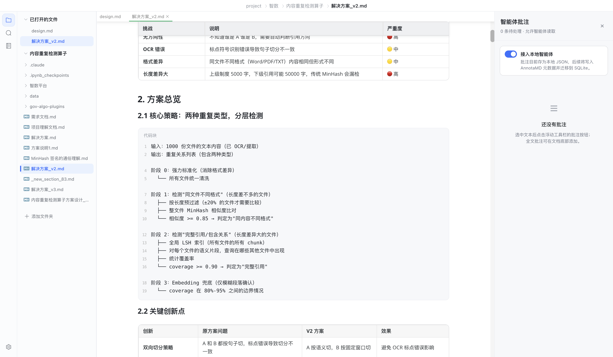

# AnnotaMD

**AnnotaMD 是一款本地优先、具有飞书文档体验的所见即所得 Markdown 编辑器。**

它保留 Markdown 文件开放、可迁移、适合 Agent 读取的特点，同时加入选区批注、全文批注和现代块编辑体验，让你可以直接在文档里留下修改意见，再交给本地 AI Agent 理解并处理。



## 主要特性

- **所见即所得快编辑**：默认直接编辑渲染后的 Markdown，不需要在阅读与源码模式之间反复切换。
- **飞书式交互**：现代三栏布局、块菜单、选区浮动工具栏、紧凑代码块和图表工具栏。
- **面向 Agent 的批注**：支持选区批注与全文批注，批注独立存储，不污染 Markdown 正文，方便本地 Agent 后续读取和修改文档。
- **本地优先**：直接打开本地文件和文件夹，可同时管理多个工作区、文件标签页和文档大纲。
- **完整 Markdown 能力**：支持表格、任务列表、代码高亮、行号、自动换行、Mermaid 图表、图片预览等。
- **保留源码模式**：需要精确修改 Markdown 时，可从“视图”菜单切换源码模式。

## 下载

请前往 [GitHub Releases](https://github.com/TyroneXie/AnnotaMD/releases) 下载最新版本。

### macOS 提示

当前 GitHub Release 为未公证构建。首次拖入“应用程序”后，如 macOS 阻止打开，可执行：

```bash
xattr -cr /Applications/AnnotaMD.app
```

## 批注与 Agent 协作

AnnotaMD 的定位不是在线协作文档，而是连接本地 Markdown 与 AI Agent 的审阅界面：

1. 在文档中选中文字并添加批注；
2. 批注保存在本地元数据中，不写入 Markdown 渲染正文；
3. 本地 Agent 可读取批注、定位原文，并按意见修改 Markdown；
4. 后续版本会继续完善 SQLite 存储和更标准的 Agent 工具接入。

## 开发

环境要求：Node.js 20.19+、pnpm 10+。

```bash
pnpm install
pnpm dev
```

自动打开指定文档：

```bash
cd packages/desktop
ANNOTAMD_OPEN_FILE=/absolute/path/to/document.md \
  ./node_modules/.bin/electron-vite --remoteDebuggingPort 9222 dev -- \
  '--remote-allow-origins=*'
```

运行主要验证：

```bash
pnpm --filter marktext test:unit
pnpm --filter marktext typecheck:annotamd
pnpm --filter @muyajs/core test
```

## 项目资料

- 产品与架构资料：[`docs/`](docs/)
- V2 视觉原型：[`web/v2/`](web/v2/)
- V2 迁移方案：[`docs/v2-marktext-migration-plan.md`](docs/v2-marktext-migration-plan.md)

## 致谢与许可

AnnotaMD V2 基于 [MarkText](https://github.com/marktext/marktext) 的开源编辑器能力继续开发，感谢 MarkText 与 Muya 的所有贡献者。

本项目采用 MIT License，详见 [`LICENSE`](LICENSE)。
